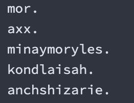
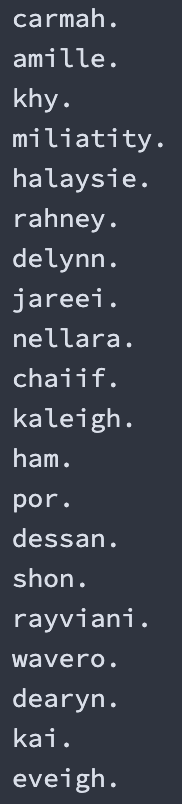

    <h1 alight="center">
        Building a Neural Network
    </h1>

# 🥳 About

This is my work following Andrej Karpathy's video series [Zero to Hero](https://www.youtube.com/playlist?list=PLAqhIrjkxbuWI23v9cThsA9GvCAUhRvKZ).

The repo includes

- Building Micrograd
- Building Makemore

## 🫥 Building Micrograd

### Micrograd from Scratch

Completely implemented micrograd by building out the Value object and using it to optimize. I then did all of the same in Pytorch (which is soooo much easier).

### Multiplayer Preceptron

Used the the micrograd Value object to create a feed forward neural network. The model acheived loss of 3.22e-5.

## 🛠️ Building Makemore

### Makemore Part 1

Built a brigram language model and evaluated in using negative log likelihood. Then rebuilt the system to utilize a neural network and sample from this network. The model was trained on a database of names and the results were disappointing.

### Makemore Part 2

This model is based off of the Bengio et al. 2003 paper but using character prediction instead of word prediction Optimized the makemore model hyperparamters through experiments and graphics. Acheived a much better model that created more name-like words.

Work in progress...
